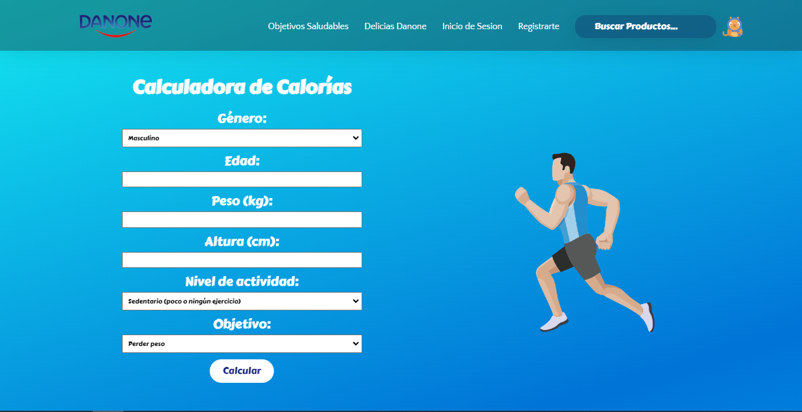
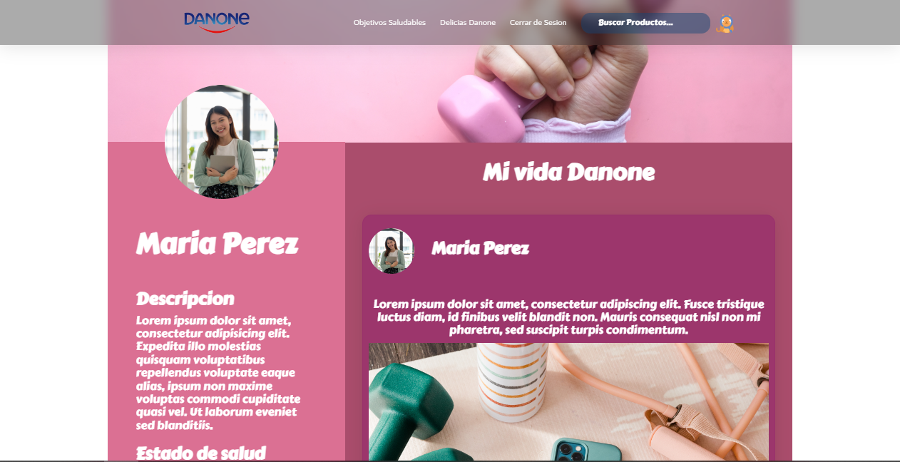

# Danone Hackathon Front-End
## Danone Eco: Descubre un mundo de sabor saludable y ecológico


El proyecto tiene como objetivo la creación de un subdominio para promocionar la gama de productos más ecológicos y saludables de Danone. Se busca proporcionar a los usuarios una experiencia atractiva y funcional a través de una página web visualmente atractiva y fácil de usar.

En términos de diseño, se plantea una serie de vistas principales que representarán la estructura básica de la página web. Se pretende incluir una página de inicio, una página de configuración de calorías diarias, una página de productos, una página de detalles del producto, una barra de búsqueda y una página de perfil del usuario.

Para priorizar la calidad del código y el diseño, se decidió no implementar todas las vistas propuestas debido a las restricciones de tiempo. Sin embargo, se buscó garantizar que las vistas realizadas cumplieran con altos estándares de calidad y fueran representativas de la gama de productos ecológicos de Danone.

En cuanto a las tecnologías utilizadas, se optó por GULP y SASS para facilitar el proceso de desarrollo y mejorar la eficiencia en la gestión de tareas y la generación de estilos. Además, se emplearon HTML, CSS y JavaScript para construir las vistas y proporcionar la funcionalidad necesaria.

Las decisiones de diseño y desarrollo se tomaron considerando la importancia de mostrar una introducción atractiva en la página de inicio, permitir a los usuarios establecer su límite máximo de calorías diarias en la página de configuración, mostrar un catálogo de productos de la gama ecológica de Danone en la página de productos y brindar detalles relevantes sobre cada producto en la página de detalles. Aunque no se pudo implementar la barra de búsqueda debido a las limitaciones de tiempo, se priorizó la creación de una página de perfil del usuario donde los usuarios pueden acceder a su información personal y modificar sus preferencias.

En resumen, el proyecto busca crear un subdominio atractivo y funcional para promocionar la gama de productos ecológicos y saludables de Danone. Aunque algunas vistas propuestas no pudieron ser desarrolladas, se priorizó la calidad del código y el diseño en las vistas implementadas, brindando una experiencia agradable para los usuarios.

# Proyecto de Página Web para Danone

La página web diseñada tiene las siguientes funcionalidades principales:

## Página de inicio

- Proporciona una introducción atractiva y visualmente agradable sobre la gama de productos ecológicos y saludables de Danone.
- Permite a los usuarios obtener una visión general de los beneficios y valores de los productos ofrecidos.


## Página de configuración de calorías diarias

- Los usuarios pueden establecer su límite máximo de calorías diarias personalizado.
- Pueden ingresar la cantidad de calorías que desean consumir como máximo en un día, utilizando un formulario o campo de entrada.



## Página de productos (no implementada)

- Contendría un catálogo de productos de la gama ecológica de Danone.
- Los usuarios podrían explorar los diferentes productos y obtener información básica sobre ellos.

## Página de detalles del producto (no implementada)

- Mostraría información detallada sobre un producto seleccionado, como el valor energético, grasas, hidratos de carbono, si procede de agricultura ecológica y sus ingredientes.
- Proporcionaría a los usuarios una descripción completa y precisa de cada producto.

## Barra de búsqueda (no completada)

- Permitiría a los usuarios buscar productos específicos dentro del catálogo.
- Al ingresar términos de búsqueda relevantes, se mostrarían los resultados correspondientes.


## Página de perfil del usuario

- Los usuarios pueden acceder a su perfil personalizado.
- Pueden ver su límite máximo de calorías diarias establecido y su interés en productos con una menor huella ecológica.
- También se les brinda la opción de modificar estos parámetros en caso de que deseen realizar ajustes.

**Nota.
    Para ingresar a la vista del perfil es necesario iniciar seción, danod clic en la barra de navegacion y seleccionando "Iniciar secion", despues solo dar clic en "Inicicar secion".**



Aunque no se lograron implementar todas las funcionalidades propuestas, las funcionalidades disponibles permiten a los usuarios configurar su límite de calorías diarias y acceder a su perfil personal. A través de estas acciones, los usuarios pueden personalizar su experiencia y tener una visión general de los productos ecológicos y saludables de Danone.

Es importante tener en cuenta que, aunque algunas funcionalidades no se hayan desarrollado, se priorizó la calidad del código y el diseño en las funcionalidades implementadas, asegurando una experiencia de usuario fluida y atractiva.

# Proyecto de Página Web para Danone

## Instalación

Antes de comenzar con la instalación, asegúrate de cumplir con los siguientes requisitos del sistema:

- Sistema operativo compatible (Windows, macOS, Linux).
- Node.js instalado en tu máquina. Puedes descargarlo e instalarlo desde el [sitio web oficial de Node.js](https://nodejs.org).
- Gestor de paquetes npm, que viene incluido con Node.js.

A continuación, sigue los siguientes pasos para la instalación y configuración del proyecto:

1. Clona el repositorio del proyecto desde el repositorio remoto:

   ```
   git clone <URL_DEL_REPOSITORIO>

2. Navega hasta el directorio del proyecto:

    ```
    cd nombre_del_directorio_del_proyecto

3. Instala las dependencias de desarrollo necesarias (scss, gulp y plumber) ejecutando el siguiente comando:

    ```
    npm install --save-dev gulp gulp-sass gulp-plumber

4. Una vez finalizada la instalación de las dependencias, ejecuta el siguiente comando para compilar los estilos y generar los archivos necesarios:

    ```
    npx gulp dev

Este comando activará el proceso de Gulp, que compilará los archivos SCSS en CSS y generará los archivos correspondientes en la estructura de directorios del proyecto.

5. Una vez que el comando se haya ejecutado correctamente, podrás acceder a la página web a través de un navegador web o abriendo el archivo "index.html"


Ahora podrás ver y navegar por la página web desarrollada.

Aunque no se lograron implementar todas las funcionalidades propuestas, las funcionalidades disponibles y el diseño de la página web estarán visibles una vez que hayas completado los pasos de instalación mencionados anteriormente.

Recuerda que cada vez que realices cambios en los archivos SCSS, el proceso de Gulp se encargará automáticamente de compilar los estilos actualizados y reflejarlos en la página web. Esto te permitirá realizar modificaciones de manera más eficiente y ver los cambios en tiempo real mientras trabajas en el proyecto.


## Stack Utilizado

- Lenguaje de programación: HTML, CSS y JavaScript.

- Frameworks o bibliotecas:
  - SCSS (Sass): Utilizado para la generación y compilación de estilos CSS de manera más eficiente y modular.
  
- Herramientas y utilidades:
  - Gulp: Utilizado como un sistema de construcción y automatización de tareas. Se emplea para compilar los archivos SCSS, generar los estilos CSS y realizar otras tareas de optimización y mejora del flujo de trabajo.
  - Plumber: Utilizado como un manejador de errores para el flujo de trabajo de Gulp. Ayuda a prevenir que los errores detengan el proceso de compilación.

No se utilizó una base de datos en este proyecto, ya que no se requería almacenar información persistente.

Aunque no se lograron implementar todas las funcionalidades propuestas, las tecnologías utilizadas permiten la creación de una página web dinámica y atractiva. HTML se emplea para la estructura y contenido de la página, CSS y SCSS para el diseño y estilos, y JavaScript para la interactividad y la lógica del cliente.

Con la combinación de estas tecnologías y herramientas, se logra un stack completo para el desarrollo de la página web, permitiendo una experiencia de usuario fluida y una estructura de código mantenible.

# Toma de Decisiones

Durante el desarrollo del proyecto de la página web para Danone, se tomaron varias decisiones en cuanto a la selección de tecnologías, diseño y arquitectura. A continuación, se proporciona una explicación subjetiva de algunas de estas decisiones:

## Selección de tecnologías

- SCSS: Se eligió utilizar SCSS como preprocesador de CSS debido a su capacidad para generar estilos más eficientes y modulares. Esto permitió una mejor organización del código CSS y una mayor reutilización de estilos.
- Gulp y Plumber: Se optó por utilizar Gulp como sistema de construcción y automatización de tareas, y Plumber como manejador de errores. Estas herramientas ayudaron a optimizar el flujo de trabajo, permitiendo la compilación de SCSS, generación de estilos CSS y detección de errores de manera más eficiente.

## Diseño y arquitectura

- Decisiones de diseño: Se buscó crear una página web visualmente atractiva y centrada en la presentación de la gama de productos ecológicos y saludables de Danone. Se eligieron colores y elementos visuales que transmitieran la idea de salud, sostenibilidad y frescura.
- Arquitectura de la página: Se decidió seguir una estructura de páginas separadas, lo que permitió una mejor organización y mantenimiento del código. Cada página se dividió en componentes reutilizables para facilitar la escalabilidad y futuras modificaciones.

## Ventajas y desventajas consideradas

- Tiempo limitado: La falta de tiempo fue un factor determinante en la implementación de todas las funcionalidades propuestas y la creación de una versión completamente responsiva. Se priorizó la calidad del código y la funcionalidad esencial para mostrar al cliente una muestra significativa del proyecto.
- No se utilizó Headless CMS: Aunque Headless CMS, como Contentful, es una opción popular para la gestión de contenido, debido a las restricciones de tiempo no fue posible implementarlo en este proyecto. Sin embargo, se consideró y se estudió su uso para futuras mejoras y escalabilidad.

Es importante destacar que estas decisiones se tomaron considerando los recursos disponibles, el tiempo limitado y los objetivos específicos del proyecto. Se buscó maximizar la calidad del código y la experiencia de usuario dentro de las limitaciones existentes. En futuras iteraciones del proyecto, se podrían considerar otras tecnologías y funcionalidades para mejorar aún más la página web.
